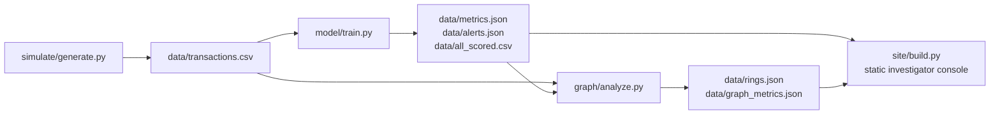

# RISK//RING

**Financial-crime network intelligence: a trained fraud classifier with honest
metrics, SHAP explainability, and graph-based collusion-ring detection,
evaluated against known ground truth instead of asserted.**

Part of the RISK// family alongside [risk-os](https://github.com/Jeevan-0508/risk-os),
[risk-replay](https://github.com/Jeevan-0508/risk-replay) and
[risk-swarm](https://github.com/Jeevan-0508/risk-swarm).

## What this is

Most fraud-detection portfolio projects train a classifier on a Kaggle CSV
and report accuracy. Two problems with that: the classic datasets are
PCA-anonymized (no account IDs, so no network structure to analyze), and
"accuracy" on a 99.8%-legitimate dataset is meaningless.

This project instead:
1. **Simulates** a transaction network with a known, injected number of
   money-laundering rings running real FATF-documented typologies
   (structuring/smurfing, layering, round-tripping), so ground truth exists
   and detection quality can be *measured*, not claimed.
2. **Trains** a classifier on causally-engineered features (no peeking at
   the future), reports precision/recall/PR-AUC honestly, and explains every
   flagged transaction with SHAP.
3. **Builds a transaction graph** seeded from the model's riskiest
   transactions and runs community detection to recover the actual
   collusion rings behind the flagged transactions, scored against the
   ground truth the simulator recorded.

## Why simulated data, not a downloaded dataset

Real transaction/customer data can't legally be shared, and the standard
public fraud dataset (Kaggle's `creditcard.csv`) has no account or
counterparty IDs, so it cannot support any network analysis. Building the
simulator is also its own demonstration: the typologies below are modeled
on FATF's published typology reports and the EUR 10,000 reporting threshold
used in EU cash-transaction reporting rules, not invented.

| Typology | Pattern | Reference |
|---|---|---|
| Structuring / smurfing | Several accounts each send amounts just under the reporting threshold to one collector, which cashes out shortly after | FATF, "Money Laundering Through Money Remittance and Currency Exchange Providers", 2010 |
| Layering | Money is moved through a fast chain of accounts (minutes-to-hours), a small cut taken at each hop, to obscure origin | FATF, "Laundering the Proceeds of Corruption", 2011 |
| Round-tripping | Funds are cycled back toward their origin through intermediaries to mimic ordinary business flow | FATF/Egmont Group, "Concealment of Beneficial Ownership", 2018 |

Ring accounts also run realistic camouflage transactions with ordinary
accounts (so a fraud account's history isn't trivially distinguishable by
"never transacts normally"), and 3% of ordinary accounts run legitimate
sub-threshold transfers of their own (splitting a real purchase across days)
so the classifier faces genuine false-positive pressure, not a free pass.

## Results (this run, seed=42)

**Dataset:** 20,373 simulated transactions, 576 fraud (2.83%), 20 rings across
the 3 typologies above. Time-based split: train on the first 70% of
simulated days, test on the last 30% — a random shuffle would leak future
transactions from the same accounts into training.

**Classifier** (test set, 6,112 transactions):

| Model | Precision | Recall | F1 | ROC-AUC | PR-AUC |
|---|---|---|---|---|---|
| Logistic Regression (baseline) | 0.730 | 1.000 | 0.844 | 0.999 | 0.960 |
| XGBoost | 0.821 | 1.000 | 0.902 | 1.000 | 0.995 |

Recall is high because every ring in this simulation stays inside the
typologies above and those have a real structural signature (a fresh account
bursting into activity, an amount pinned just under a threshold) — a
detector that never misses those specific patterns is expected. Precision
under 1.0 is the honest number: it's the cost of the benign look-alikes
(ordinary accounts splitting a real purchase into sub-threshold transfers)
that were deliberately added so the model has to discriminate, not just
threshold on amount.

**Explainability:** every flagged transaction in `data/alerts.json` carries
its top 4 SHAP-contributing features (e.g. "amount near reporting threshold",
"first time this account pair has transacted", "unusually high transaction
velocity for this account") — the same style of explanation a BaFin/GwG
audit trail requires, not just a bare risk score.

**Graph / collusion-ring recovery:** seed a subgraph from the top 5% riskiest
transactions, expand to their direct counterparties (2,104 nodes, 10,365
edges), run Louvain community detection, and check the result against the
20 known rings.

| Louvain resolution | Communities | Avg. ring recall | Avg. ring precision |
|---|---|---|---|
| 1.0 (default) | 23 | 0.818 | 0.074 |
| 2.0 | 61 | 0.819 | 0.203 |
| 5.0 | 135 | 0.784 | 0.495 |
| **12.0 (chosen)** | **227** | **0.771** | **0.764** |
| 20.0 | 404 | 0.738 | 0.809 |

Default-resolution communities recover most of each ring (0.82 recall) but
are far too coarse to hand to an investigator — 0.07 precision means 93% of
each flagged community is unrelated accounts pulled in through camouflage
transactions. Tuning resolution to 12 trades a little recall for communities
an investigator could plausibly act on (0.77/0.76). Layering and round-trip
rings recover cleanly (0.83-1.0 recall, 0.5-1.0 precision) because they're
tight chains/cycles; smurfing rings recover less well (0.4-0.55 recall)
because a many-to-one fan-in is structurally sparser — a real limitation of
community detection on this topology, not hidden in these numbers.

## Architecture

Heavy compute (simulation, model training, SHAP, graph analysis) runs
offline in Python and exports small JSON files. The shipped site is static
— no backend, no live retraining, same hosting pattern as the rest of the
RISK// family.

Reproduce: `pip install -r requirements.txt && python simulate/generate.py
&& python model/train.py && python graph/analyze.py`

## Tests

`pytest tests/` — 10 tests covering simulator invariants (structuring stays
under threshold, layering amounts decrease each hop, round-trips return to
origin), causal feature engineering (features never see the future), and
the graph-evaluation function (recall/precision math against toy ground
truth).

## License

MIT
